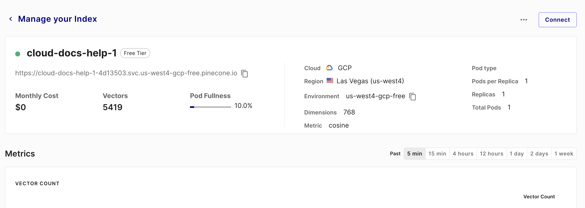

# This is to show the usage of PDF query based service based on Pinecone vector DB

This requires two env variables:  
1. **PINECONE_API_KEY**
2. **PINECONE_API_ENV**

* Another important thing is the **PINECONE_INDEX_NAME**:  
This is important because if dimensions are not matching, exception will be raised.

Refer Pinecone console 

