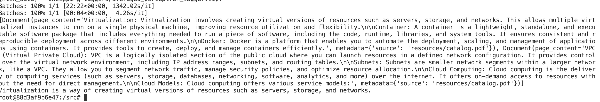

# Using HuggingFace, ChromaDB to get the PDF based question and answers.

**Challenges faced  -**
Mostly around Dependency Hell, Creating docker image is a tedious task in this.

> Keeping this as the default LLM transformer.

Query - What is Virtualization?
